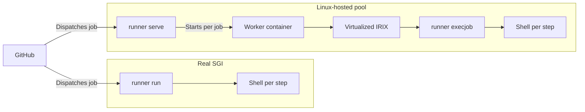

# irix-actions-runner

[](https://github.com/sgidevnet/irix-actions-runner/actions/workflows/ci.yml)

A native GitHub Actions self-hosted runner for SGI IRIX 6.5.22 and later.

- Run jobs directly on an SGI workstation.
- Run a pool of virtualized SGI Indys from a Linux host.

GitHub's runner requires .NET, which is unavailable on IRIX. This is a
clean-room C99 implementation of the runner protocol. The IRIX release is a
single n32 MIPS III binary with OpenSSL linked statically.

[irix-actions-figlet-demo](https://github.com/sgidevnet/irix-actions-figlet-demo)
is an example workflow repository. [Here is a matrix job running on 10
virtualized Indys](https://github.com/sgidevnet/irix-actions-figlet-demo/actions/runs/30564803634).

## Requirements

| Mode | Requirements | Command |
|---|---|---|
| SGI | IRIX 6.5.22+, R4000 or later | `runner run` |
| Virtualized pool | Linux x86_64 or arm64, glibc 2.39+, OpenSSL 3, Docker | `runner serve` |

- The IRIX binary is n32 and MIPS III.
- Tested on IRIX 6.5.30m. Earlier 6.5.x releases are untested.
- The released runner does not require SGUG-RSE.
- `actions/checkout` requires Git 2.18+ in the guest.
- Artifact upload and download require `zip` and `unzip` in the guest.

## Run on an SGI

Download the IRIX tarball from
[Releases](https://github.com/sgidevnet/irix-actions-runner/releases). Stock
IRIX `tar` cannot decompress it:

```sh
gzip -dc irix-actions-runner-*-irix6.5-mips-n32.tar.gz | tar xvf -
cd irix-actions-runner-*
```

Check TLS, certificates, HTTP and the system clock:

```sh
./runner selftest
```

The tarball includes `cert.pem`. Keep it beside the binary, or set
`SSL_CERT_FILE`.

Get a registration token from Settings, Actions, Runners, New self-hosted
runner. Or, from a machine with `gh`:

```sh
gh api -X POST repos/OWNER/REPO/actions/runners/registration-token --jq .token
```

Register and start:

```sh
./runner configure --url https://github.com/OWNER/REPO --token TOKEN
./runner run
```

Configuration is stored beside the binary in `.runner`, `.credentials` and
`.rsakey`.

## Run virtualized Indys on Linux

Download the Linux tarball from
[Releases](https://github.com/sgidevnet/irix-actions-runner/releases):

```sh
tar xzf irix-actions-runner-*-linux-*.tar.gz
cd irix-actions-runner-*
./runner selftest
```

`selftest` checks the Docker socket. The account running `serve` needs read and
write access to `/var/run/docker.sock`.

Register one identity per concurrent job:

```sh
./runner configure --url https://github.com/OWNER/REPO --token TOKEN \
    --count 4 --name-prefix irix
```

Start the pool:

```sh
./runner serve --count 4 --name-prefix irix \
    --image ghcr.io/sgidevnet/irix-worker:0.4.3-indy
```

- Always pass `--image`. The default `irix-worker:latest` resolves against
  Docker Hub, where it does not exist.
- `--count 4` creates `irix-0` through `irix-3`.
- Each identity has separate credentials and a separate work directory.
- One registration token covers the pool.
- The maximum pool size is 64.
- Each job gets a fresh container and a restored IRIX guest.
- Custom worker images require an operator-supplied IRIX disk.

## Organisation runners

```sh
gh api -X POST orgs/ORG/actions/runners/registration-token --jq .token

./runner configure --url https://github.com/ORG --token TOKEN \
    --runnergroup IRIX
```

- Add `--count` and `--name-prefix` for a virtualized pool.
- `--runnergroup` defaults to `Default`.
- A runner in a group without repository access appears Online but receives no
  jobs.

## Labels

Every runner has:

```text
self-hosted, Linux, X64, irix, mips, mips-n32
```

`Linux` and `X64` are required system labels. GitHub has no IRIX or MIPS
equivalent. Use the accurate custom labels to select the runner:

```yaml
runs-on: [self-hosted, irix]
```

Pools created with `--count` also have `emulated`:

```yaml
runs-on: [self-hosted, irix, emulated]
```

For hardware-only jobs, configure the SGI with `--labels hardware` and select
that label. `runs-on` cannot exclude labels.

`runner.os` and `RUNNER_OS` default to `Linux`. Override both with:

```sh
SGUG_RUNNER_OS=IRIX ./runner run
```

Most third-party actions handle `Linux` better than an unknown OS, so the
override is usually unnecessary.

## First workflow

Create `.github/workflows/irix.yml`:

```yaml
name: irix
on: [push, workflow_dispatch]

jobs:
  system:
    runs-on: [self-hosted, irix]
    steps:
      - run: |
          uname -a
          hinv
```

## Workflow support

Supported:

- `run:` under `bash` and `sh`
- `${{ }}` expressions in `run:`, `with:` and `if:`
- `actions/checkout`
- `actions/upload-artifact`
- `actions/download-artifact`
- Live step status and console output
- Streamed logs
- Secret masking
- Cancellation
- Per-step resource limits

These fail the step with an error:

- `hashFiles()`
- The `steps` context
- Any other `uses:` action
- JavaScript actions
- Docker actions
- Container jobs
- Service containers

JavaScript actions are not planned.

### Silent differences

| Feature | Behavior | Alternative |
|---|---|---|
| `env:` | `${{ env.NAME }}` resolves, but `$NAME` is not exported | Put `${{ env.NAME }}` in `run:` |
| Workflow commands | `::error::`, `::add-mask::` and `::set-output::` print literally | None |
| GitHub files | No `$GITHUB_ENV`, `$GITHUB_OUTPUT`, `$GITHUB_PATH` or `$GITHUB_STEP_SUMMARY` | Keep dependent commands in one step or exchange ordinary files |
| `$GITHUB_TOKEN` | Not set | None |
| Step `timeout-minutes:` | Ignored; the local deadline is 3,600 seconds | Use job-level `timeout-minutes` |
| `checkout` with `ref:` | Checks out `github.sha` | Run `git checkout` in the next step |
| Step `id:` | Stored, but unreadable without the `steps` context | Do not depend on step outputs |

### Shell and environment

Step environments are built from scratch. `PATH` is:

```text
/usr/sgug/bin:/usr/sgug/sbin:/usr/bin:/bin:/usr/sbin:/usr/bsd
```

- Nekoware and Freeware are not included.
- Extend `PATH` inside every step that needs them. Changes do not carry to the
  next step.
- The virtualized guest keeps `gcc` and `curl` in `/usr/nekoware/bin`.
- That `curl` needs
  `--cacert /usr/sgug/etc/pki/tls/certs/ca-bundle.crt` for HTTPS.
- Git over HTTPS uses the SGUG certificate bundle automatically.
- Steps run with `-e`; bash also uses `-o pipefail`.
- `cmd | head -1` can fail with SIGPIPE. Use `sed -n 1p`.
- `shell:` accepts `bash` and absolute interpreter paths. Unknown names fall
  back to the default shell.

On real hardware, the workspace remains between jobs and `checkout` does not
remove untracked files. Use `git clean -xdff` when a clean tree matters. Jobs
under `serve` always get a fresh container.

### Artifact paths

- `checkout` and `download-artifact` create `path:` with one `mkdir`. Create
  the parent before using a nested path such as `all/0`.
- `upload-artifact` keeps the leading path component. Uploading `path: out`
  stores `out/...`; GitHub's action stores only the contents of `out`.
- Set `path:` explicitly when downloading artifacts between hosted and IRIX
  runners.

## How it works



`serve`:

- Runs one listener per identity.
- Writes each job to a mode 0700 directory under `$TMPDIR`.
- Mounts that directory into the worker at `/job`.
- Forwards Ctrl-C and `SIGTERM` to every listener.
- Removes containers left by an unclean previous exit.
- Uses `/var/run/docker.sock`, or a `unix://` socket from `DOCKER_HOST`.
- Rejects TCP Docker endpoints.

Virtualized workers have:

- 256 MiB of guest RAM
- Roughly one host CPU core per job
- A fresh container for every job
- Userspace NAT

iris executes MIPS IV instructions regardless of the emulated CPU. A build can
pass in virtualization and fault on an R4000 or R5000. Real hardware remains
the portability gate.

Outbound ping requires a compatible Docker `net.ipv4.ping_group_range`. The
emulator's NAT gateway still answers.

## Confinement

| Limit | Default |
|---|---:|
| Step wall clock | 3,600 s |
| `--job-timeout` under `serve` | 14,400 s |
| `RLIMIT_CPU` | 3,600 s |
| `RLIMIT_AS` | 1,536 MB |
| `RLIMIT_FSIZE` | 4,096 MB |
| `RLIMIT_NOFILE` | 512 |
| `RLIMIT_CORE` | 0 |
| `prctl(PR_MAXPROCS)` | 96 |
| `prctl(PR_TERMCHILD)` | on |

- IRIX has no `RLIMIT_NPROC`; `PR_MAXPROCS` limits fork bombs.
- `chroot` plus a uid drop is implemented for root and remains untested.
- IRIX has no namespaces, seccomp, jails or network isolation.
- Workflows on real hardware can reach the local network.
- Use GitHub's fork approval setting for untrusted pull requests.

## Building from source

Linux:

```sh
sudo apt-get install -y gcc libssl-dev
make
make test
```

IRIX, using [SGUG-RSE](https://github.com/sgidevnet/sgug-rse) 0.0.7beta:

```sh
/usr/sgug/bin/sgugshell make
make check
make test
```

- `make` uses GCC 9.2 on IRIX.
- `make check` compiles every source file with MIPSPro 7.4.4m.
- Release binaries are cross-compiled with clang and LLD against OpenSSL
  1.1.1w.
- The release checks the MIPS ISA and dynamic library dependencies.

## Commands

| Command | Purpose |
|---|---|
| `runner configure` | Register and write credentials |
| `runner run` | Listen and execute jobs in the current process |
| `runner serve` | Run a Linux-hosted pool of virtualized Indys |
| `runner execjob` | Run one job message inside the worker guest |
| `runner status` | Show the configured identity and server details |
| `runner selftest` | Check TLS, certificates, HTTP, clock and Docker |
| `runner remove` | Deregister and delete local configuration |
| `runner version` | Print runner and protocol versions |
| `runner help` | Print commands and flags |

[`man/runner.1`](man/runner.1) documents every flag, default and failure mode.

To unregister, get a fresh registration token:

```sh
./runner remove --token TOKEN
```

For a pool, pass the same `--count` and `--name-prefix` used during
configuration.

## Why

SGUG-RSE had no way to build and test packages on the hardware it targets.
Every surviving SGI machine was locked out of modern CI.

## Authorship

Built by [@mach-kernel](https://github.com/mach-kernel) with Claude Opus 5.

## License

MIT. See [LICENSE](LICENSE).
