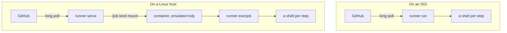

# irix-actions-runner

[](https://github.com/sgidevnet/irix-actions-runner/actions/workflows/ci.yml)

A native GitHub Actions self-hosted runner for SGI IRIX 6.5.22 and later. GitHub's official runner is .NET and cannot run there, so this is a clean-room reimplementation of the runner wire protocol in C99. It ships as a single n32 binary whose only dependencies are the IRIX base libraries and a statically linked OpenSSL.

Run it on the SGI itself, or on a Linux host that serves a pool of emulated Indys, one container per job.

[irix-actions-figlet-demo](https://github.com/sgidevnet/irix-actions-figlet-demo) is two worked examples: building figlet from upstream, and [ten jobs on ten emulated Indys at once](https://github.com/sgidevnet/irix-actions-figlet-demo/actions/runs/30564803634), which finishes in thirty-two seconds.

`runner help` lists every command and flag. [`man/runner.1`](man/runner.1) carries the defaults, ranges and failure modes that do not fit there, and ships in the tarball as `runner.1`.

## Requirements

| | |
|---|---|
| On an SGI | IRIX 6.5.22 or later, on an R4000 or later CPU. The binary is n32, MIPS III |
| On a Linux host | x86_64 or arm64, glibc 2.39 or newer, OpenSSL 3, and Docker |
| `run:` steps | nothing beyond base IRIX |
| `uses:` steps | `git` 2.18+, `zip` and `unzip`, inside the guest |

Built and tested on IRIX 6.5.30m. Earlier 6.5.x releases are expected to work and are untested. The Linux binaries are built on Ubuntu 24.04.

The IRIX tarball carries `cert.pem`, found automatically when it sits next to the binary. `SSL_CERT_FILE` overrides it, and SGUG-RSE's own bundle at `/usr/sgug/etc/pki/tls/cert.pem` is used when neither is present. The Linux tarballs carry no bundle, because the distribution maintains one already.

Configuration is written beside the binary as `.runner`, `.credentials` and `.rsakey`, or one set per identity directory under `--count`.

## Getting started

You need a GitHub repository or organisation you can administer. On a Linux host you also need Docker, and `serve` needs read and write on `/var/run/docker.sock`, which usually means the `docker` group.

**1. Install.** Download the tarball for your platform from the [releases page](https://github.com/sgidevnet/irix-actions-runner/releases). Stock IRIX `tar` cannot decompress, so pipe it through `gzip`:

```sh
gzip -dc irix-actions-runner-*.tar.gz | tar xvf -
cd irix-actions-runner-*
```

**2. Check the machine is ready.**

```sh
./runner selftest
```

This checks TLS, the certificate bundle, HTTP and the clock, and on Linux the Docker socket, and prints what it found. Run it before anything else: a wrong clock and an expired CA bundle are the two things that break a fresh install, and both produce confusing errors later if you skip this.

**3. Get a registration token.** In your repository go to Settings, Actions, Runners, New self-hosted runner, and copy the token. Or:

```sh
gh api -X POST repos/OWNER/REPO/actions/runners/registration-token --jq .token
```

**4. Register.**

```sh
./runner configure --url https://github.com/OWNER/REPO --token <token>
```

**5. Start it.** This is the only step that differs by mode:

| | On an SGI | On a Linux host |
|---|---|---|
| step 4 also takes | nothing | `--count 4 --name-prefix irix` |
| step 5 | `./runner run` | `./runner serve --count 4 --name-prefix irix --image ghcr.io/sgidevnet/irix-worker:0.4.3-indy` |

The runner appears under Settings, Actions, Runners. Leave it running.

**Always pass `--image`.** The default is the bare name `irix-worker:latest`, which Docker resolves against Docker Hub, where it does not exist.

`--count` registers N identities as `irix-0` through `irix-3`, each holding its own `.runner`, `.credentials` and `.rsakey` and each named after its directory. One registration token covers the whole pool, and it is not needed again: every identity authenticates with an RSA key of its own from here on. 64 identities is the ceiling.

**Organisation-wide.** `--url` takes an organisation as readily as a repository, with the token from `gh api -X POST orgs/ORG/actions/runners/registration-token`. Add `--runnergroup NAME`; it defaults to `Default`, and getting it wrong is quiet, because the runner registers, shows Online, and is never dispatched to, since the group it landed in has no access to the repository whose workflow is queued.

**Labels.** Every runner carries `irix`, `mips` and `mips-n32`. `--count` adds `emulated`, so `runs-on: [self-hosted, irix, emulated]` pins a job to the Docker pool and leaving it off does not. `--labels a,b,c` adds your own on top.

**6. Give it something to do.** Commit this as `.github/workflows/irix.yml`:

```yaml
name: irix
on: [push, workflow_dispatch]

jobs:
  build:
    runs-on: [self-hosted, irix]
    steps:
      - uses: actions/checkout@v4
      - run: |
          uname -a
          make
```

To uninstall, `./runner remove --token <token>`, with the same `--count` and `--name-prefix` if you used them.

## Conformance

GitHub resolves `on:`, `needs:`, `strategy`, `permissions`, `concurrency` and job-level `if:` on its own servers. The runner never sees a workflow file, only one fully-resolved job, so its conformance surface is the step, the expression language and the contexts.

| Surface | Conformance |
|---|---|
| `${{ }}` expression language | 1015 of 1015 cases in GitHub's own corpus |
| Expression functions | 11 of 12 |
| Contexts | 10 of 12 |
| Step keys | 5 of 11 in full, 5 partial, 1 ignored |
| Default environment variables | 27 of 44 |
| `uses:` actions | 3, native |
| JavaScript and Docker actions | none, and not planned |

The expression figure is GitHub's own cross-language conformance corpus, vendored at [`test/fixtures/expressions`](test/fixtures/expressions) and run by `make test`. Five cases are marked skip by the corpus itself. Fifty-one differ only in case folding above ASCII, because .NET's `OrdinalIgnoreCase` folds the whole of Unicode and this folds ASCII, so `'Ü' == 'ü'` is false where GitHub says true.

**Works**, identically on an SGI and on a Linux host:

- Registration against a repository or an organisation
- The v2 broker long poll, with mid-session migration
- `run:` under `bash` and `sh`, with per-step status and timing
- Live step state and live console output while the job runs
- Logs of any size, streamed in blocks
- `${{ }}` in `run:`, `with:` and `if:`
- `actions/checkout`, `actions/upload-artifact` and `actions/download-artifact`, native, against `git` and `zip`
- Secret masking, cancellation, prompt shutdown, and resource limits on every step

**Fails the step by name.** `hashFiles()`, the `steps` context, any other `uses:`, and Docker or container steps. You get a named error and the job stops.

**Does nothing, silently.** The list that costs an afternoon:

- An `env:` block never reaches the step's shell, so `$NAME` is empty
- `::error::`, `::add-mask::` and `::set-output::` print literally
- No `$GITHUB_ENV`, `$GITHUB_OUTPUT`, `$GITHUB_PATH`, `$GITHUB_STEP_SUMMARY` or `$GITHUB_TOKEN`, so steps cannot pass values to each other or call the REST API
- `timeout-minutes:` on a step is parsed and ignored. Job-level `timeout-minutes` is server-side and does work
- A step `id:` arrives and is stored, but nothing can read it without a `steps` context

`chroot` plus a uid drop is implemented, needs root, and is untested.

## Writing workflows

Most workflow YAML works unchanged. Seven things to write differently, and the first four produce no error at all.

| Instead of | Write |
|---|---|
| `$NAME` from an `env:` block | The value in the `run:` text. `env:` is readable as `${{ env.NAME }}` but is not exported to the step's shell |
| `$GITHUB_OUTPUT`, `$GITHUB_ENV`, `::` commands | Nothing. Steps cannot pass values to each other, and no `GITHUB_TOKEN` reaches them |
| `timeout-minutes:` on a step | Nothing. Every step gets 3600 seconds, and a step that hits that cancels the job |
| `ref:` on `checkout` | A `run:` step with `git`. `ref:` is read only when `github.sha` is empty, which no real trigger produces |
| A tool from `/usr/nekoware/bin` or `/usr/freeware/bin` | Extend `PATH` in the step that needs it. It is fixed at `/usr/sgug/bin:/usr/sgug/sbin:/usr/bin:/bin:/usr/sbin:/usr/bsd`, and nothing carries an addition to the next step |
| A nested `path:` on `checkout` or `download-artifact` | One level. Both `mkdir` exactly once, so `path: all/0` fails |
| `path: out` on `upload-artifact`, expecting GitHub's layout | It is `zip -r out`, so the members are `out/...` where the reference action strips that component and a download lands one level deeper |

Steps run under `-e`, and bash steps under `-o pipefail`, matching GitHub. Two consequences worth knowing before you hit them. `shell:` only understands `bash` and absolute paths, and any other value falls through to bash, so `shell: python` runs your Python as a shell script. And `cmd | head -1` kills the producer with SIGPIPE, which fails the step, so reach for `sed -n 1p`.

The workspace is never wiped between jobs and `checkout` does not remove untracked files, so run `git clean -xdff` when a clean tree matters. This inverts under `serve`, where every job gets a fresh container.

[`.agents/skills/irix-workflows/`](.agents/skills/irix-workflows) is the full matrix, cited to `file:line`, as an [Agent Skill](https://agentskills.io). Copy the directory into your own repository to give an agent writing workflows there the same rules. `.agents/` is the neutral path; `.claude/skills/`, `.gemini/skills/`, `.opencode/skills/` and `.cursor/skills/` are symlinks into it, because each agent scans its own directory.

JavaScript actions are not planned. V8 dropped its MIPS backends in 2023, and Node sits on libuv, which has no IRIX backend. Run JS steps on a hosted runner and hand the result to IRIX in a separate job.

### Example: cross-build, then verify

Vintage SGI CPUs take hours on a large package where a cross-compiler takes minutes. This shape gives the SGI only the part that has to run on IRIX.

```yaml
jobs:
  build:
    runs-on: ubuntu-latest
    steps:
      - uses: actions/checkout@v4
      - run: ./cross-build.sh          # clang targeting mips-sgi-irix6.5
      - uses: actions/upload-artifact@v4
        with: { name: rpms, path: out/ }

  verify:
    needs: build
    runs-on: [self-hosted, irix]
    steps:
      - uses: actions/download-artifact@v4
        with: { name: rpms }
      - run: ./run-tests.sh
```

## How a job runs

The runtime is split client/server, and one binary is both halves. The server holds the registration and long-polls GitHub for work. The client is the job runtime: it takes one job as a message file, runs the steps and reports. On an SGI both halves are one process. Under `serve` they come apart, and `runner execjob` needs no registration of its own because the job message carries the credentials it reports with.



`serve` forks one child per identity, each long-polling on its own. A job a child accepts is written to a staging directory under `$TMPDIR`, mode 0700, and bind mounted at `/job` in a fresh container, where the guest restores a snapshot of a booted IRIX rather than cold booting. Ctrl-C or `SIGTERM` forwards to every child once and then waits for all of them, so no identity is left holding a pool session, and a `serve` that starts after an unclean exit reaps the containers its predecessor left behind.

`DOCKER_HOST` overrides the socket path when it names a `unix://` socket; any other form is an error rather than a silent fallback. There is no compose file and no server image.

### What is different under Docker

- **iris decodes MIPS IV** whatever CPU it reports, so a build can pass here and fault on an R4400. Real hardware stays the release gate.
- **Each job gets a fresh container.** Nothing survives between jobs, and `actions/checkout` re-clones every time.
- **256 MiB of guest RAM** and roughly one host core per job.
- **The guest is not a full SGUG-RSE install.** `ghcr.io/sgidevnet/irix-worker:0.4.3-indy` carries `git`, `bash`, `zip` and `unzip` from SGUG plus a Nekoware tree, so `gcc` 3.4.6 and `curl` sit in `/usr/nekoware/bin`, off a step's `PATH`. That `curl` also ships no CA bundle, so an HTTPS fetch needs `--cacert /usr/sgug/etc/pki/tls/certs/ca-bundle.crt`. `git` over HTTPS is unaffected, which is why `checkout` works.
- **Outbound ping does not work** in a default container. iris opens an unprivileged ICMP socket, which needs `net.ipv4.ping_group_range` to cover the process GID, and Docker's default is `1 0`. Ping to the emulator's own NAT gateway is answered synthetically and still works.

## Runner identity

The machine runs IRIX on big-endian MIPS. The runner reports Linux on x86-64, because GitHub's system labels are a fixed vocabulary with no IRIX or MIPS value and ordinary workflows say `runs-on: [self-hosted, linux, x64]`. A runner describing itself accurately matches nothing.

| Reported | Value sent | Accurate | Consumed by | Effect |
|---|---|---|---|---|
| system label | `Linux` | no, it is IRIX | `runs-on` matching | Required |
| system label | `X64` | no, it is MIPS n32 | `runs-on` matching | Required |
| user labels | `irix`, `mips`, `mips-n32`, plus your own | yes | `runs-on` matching | Deliberate targeting |
| `osDescription` | `IRIX 6.5 mips` | yes | runner list in the UI | Display only |
| `runnerOS`, `os=` | `Linux` | no | nothing | Not validated |
| `RUNNER_OS` | `Linux` | no, by default | `if:` conditions | Branch selection |

`RUNNER_OS` is the only one worth changing, and it is a flag:

```sh
SGUG_RUNNER_OS=IRIX ./runner run
```

Off by default: when `runner.os == 'Linux'` fails, third-party actions usually fall through to their macOS or Windows branch, which fits IRIX worse.

## Confinement

Limits are applied in the child between fork and exec.

| Limit | Default | Bounds |
|---|---|---|
| step wall clock | 3600 s | a step that stops making progress. Hitting it cancels the job |
| `--job-timeout` | 14400 s | a wedged emulator under `serve`, which no step limit can reach |
| `RLIMIT_CPU` | 3600 s | an infinite loop, indistinguishable from a long compile until this fires |
| `RLIMIT_AS` | 1536 MB | a link step driving the machine into swap |
| `RLIMIT_FSIZE` | 4096 MB | a runaway writer filling the disk |
| `RLIMIT_NOFILE` | 512 | descriptor exhaustion |
| `RLIMIT_CORE` | 0 | a crashing compiler dumping more than the workspace holds |
| `prctl(PR_MAXPROCS)` | 96 | a fork bomb. IRIX has no `RLIMIT_NPROC` |
| `prctl(PR_TERMCHILD)` | on | a backgrounded process outliving its job |

The defaults suit a machine with a couple of gigabytes of RAM. On a smaller one, lower `RLIMIT_AS`.

This bounds accidents, not adversaries. `chroot` plus an unprivileged uid plus rlimits is the entire toolbox IRIX provides: no namespaces, no seccomp, no jails, no network isolation, so a step can reach the local network. Under `serve` the step runs in an emulated machine inside a container, and the emulator's network is userspace NAT. For untrusted input, use GitHub's fork pull request approval setting under Settings, Actions, General. No local confinement substitutes for it.

## Building from source

On Linux, `gcc` and `libssl-dev`. The parser output is committed, so there is no generator step:

```sh
sudo apt-get install -y libssl-dev
make
make test          # unit tests, the same ones that run on IRIX
```

On an SGI, from [SGUG-RSE](https://github.com/sgidevnet/sgug-rse) 0.0.7beta at `/usr/sgug`, which supplies GCC 9.2 and OpenSSL 1.1.1d:

```sh
/usr/sgug/bin/sgugshell make
make check         # MIPSPro c99 compiles every source file
make test
```

`make check` is the portability gate, not a second build: MIPSPro catches the GNU extensions GCC accepts. Neither of these is what ships. Since 0.4.0 the released IRIX binary is cross-compiled on Linux with clang and LLD against a cross-built OpenSSL 1.1.1w, and the release workflow asserts the ISA and the library dependencies before packaging.

[`docs/protocol.md`](docs/protocol.md) records what github.com actually serves, which differs from the published documentation in several places that cost real time to find.

## Why

SGUG-RSE has no way to build and test packages on the hardware it targets. Every surviving SGI machine is locked out of modern CI.

## Authorship

Built by [@mach-kernel](https://github.com/mach-kernel) with Claude Opus 5.

## License

MIT. See [LICENSE](LICENSE).
